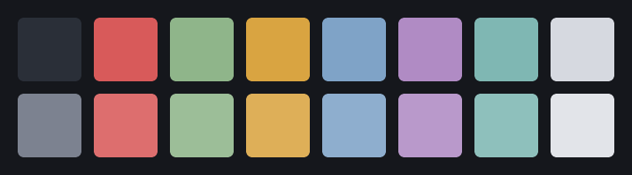
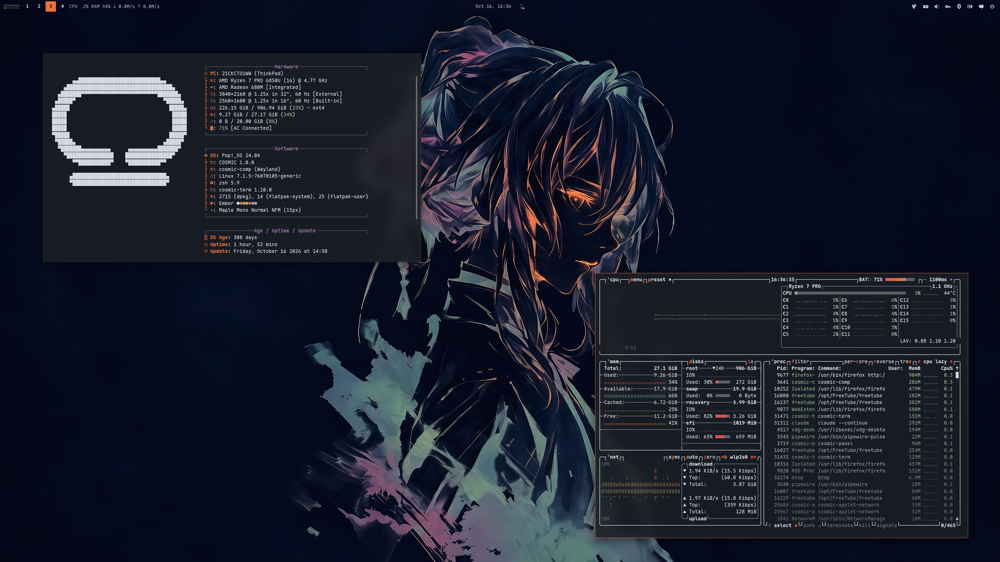
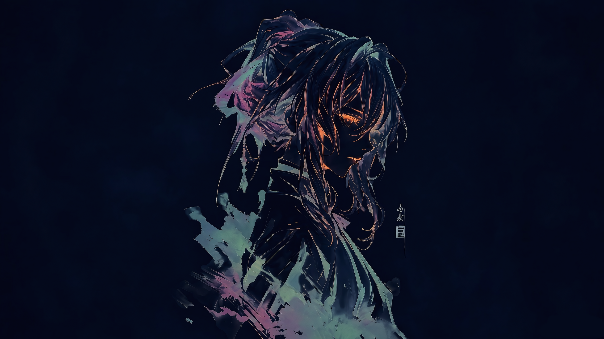

<div align="center">

# COSMIC · Ember



Pop!_OS 24.04 on COSMIC in Ember blue-black, fog and one ember accent: desktop,
terminal, shell, editor, Firefox, Brave, cursor, wallpapers. The dark half of a pair;
the light half is [cosmic-emberday-theme](https://github.com/atraxsrc/cosmic-emberday-theme).


</div>

---


## Palette

Ember is one design in two halves: cold blue-black night, warm stone day, one
ember accent shared by both. Big shapes (window, containers, text) are neutral; the
ember is small and loud (accent, window hint, commands) and everything else in the
ANSI set stays calm, pairing by lightness only. Every role you read as text clears
4.5:1 on the window  `#15171C`; the terminal is an opaque pane  `#1B1E24`, one step lighter
than the desktop.

| Role | Color | Hex |
|------|-------|-----|
| Background |  Night |  `#15171C` |
| Containers |  Soot / Pane |  `#22262E` /  `#1B1E24` |
| Terminal |  Pane, opaque |  `#1B1E24` |
| Text |  Fog |  `#D6D9E0` |
| Accent |  Ember |  `#E8713A` |
| Success |  Moss |  `#8FB58A` |
| Warning |  Amber |  `#D9A441` |
| Error |  Brick |  `#D85A5A` |
| Blue |  Slate blue |  `#7FA3C7` |
| Magenta |  Heather |  `#B08BC4` |
| Cyan |  Verdigris |  `#7FB7B3` |
| Muted |  Muted |  `#7C8290` |
| Comment |  Comment |  `#5A6070` |

Window hint  `#E8713A`. Ratios per role are in `docs/showcase.md`, or run
`python3 scripts/contrast.py`.

| Role | Ember | Ember Day |
|------|-------|-----------|
| Background |  `#15171C` |  `#E9E6DF` |
| Text |  `#D6D9E0` |  `#2B2E36` |
| Accent |  `#E8713A` |  `#A4441A` |
| Success |  `#8FB58A` |  `#4C6B45` |

---

## Repo Structure

```
.
├── alacritty
│   ├── ember.toml               # Alacritty colour scheme
│   └── install.sh
├── bat
│   ├── Ember.tmTheme            # bat syntax theme (delta uses it too)
│   ├── config                   # --theme="Ember"
│   └── install.sh
├── brave
│   ├── theme                    # Chromium theme (manifest + icons), Load unpacked
│   └── README.md
├── btop
│   └── Ember.theme              # btop colour theme
├── claude-desktop
│   ├── cosmic-ember.jsonc       # Claude Desktop theme (claude-desktop-extra), dark + light
│   └── install.sh
├── cosmic
│   ├── Ember.ron                # COSMIC Appearance import (Dark)
│   ├── config/                  # baseline settings: fonts, icons, terminal look
│   └── install.sh
├── cosmic-term
│   └── Ember-term.ron           # COSMIC Terminal colour scheme (Dark)
├── cursors
│   ├── Oxygen-Ember-*/          # cursor themes, one per icon colour, patched for COSMIC apps
│   ├── install.sh
│   ├── uninstall.sh
│   └── README.md
├── delta
│   ├── ember.gitconfig          # delta (git pager) colours, [include] it from ~/.gitconfig
│   └── install.sh
├── discord
│   ├── cosmic-ember.theme.css   # Vencord / Vesktop theme, Ember (dark) + Ember Day (light)
│   └── install.sh
├── ghostty
│   ├── Ember                    # Ghostty theme
│   └── install.sh
├── gtk
│   ├── ember.css                # GTK 3 / 4 named colours for non-COSMIC apps
│   └── install.sh
├── helix
│   ├── ember.toml               # Helix theme
│   └── install.sh
├── icons
│   └── install.sh               # Cosmic-Ember icon pack from cosmic-icon-themes
├── fastfetch
│   ├── config.jsonc             # fog / ember fastfetch config
│   ├── cosmic.txt               # COSMIC logo
│   └── install.sh
├── firefox
│   ├── theme                    # Cosmic Ember theme add-on (manifest + icons)
│   ├── chrome
│   │   ├── userChrome.css       # rounded chrome, ember menu hover
│   │   └── userContent.css      # new tab accents, blank tiles
│   ├── install.sh
│   └── README.md
├── kitty
│   ├── Ember.conf               # kitty colour scheme
│   └── install.sh
├── lazygit
│   ├── ember.yml                # lazygit colours only, stacked on your config.yml
│   └── install.sh
├── lsd
│   ├── config.yaml              # theme: custom
│   ├── colors.yaml              # permission / size / date / git columns
│   └── install.sh
├── nvim                         # Neovim colorscheme, LazyVim spec, RON syntax, install.sh
├── obsidian
│   ├── cosmic-ember.css         # CSS snippet, Ember (dark) + Ember Day (light)
│   └── install.sh
├── qt
│   ├── Ember.conf               # qt5ct / qt6ct colour scheme
│   └── install.sh
├── starship
│   ├── starship.toml            # prompt, palette colours, clock on the right
│   └── install.sh
├── telegram
│   ├── colors.tdesktop-theme    # Telegram Desktop colour scheme (source)
│   ├── cosmic-ember.tdesktop-theme  # built theme, open this in Telegram
│   └── build.sh                 # rebuilds it, optionally with a wallpaper
├── vscode
│   ├── themes/                  # Cursor / VS Code colour themes, Ember (dark) + Ember Day (light)
│   ├── package.json             # extension manifest
│   ├── install.sh               # packs a .vsix, installs it with cursor --install-extension
│   └── README.md
├── scripts
│   ├── update_system.sh         # nala + flatpak, fog ANSI for a dark terminal
│   ├── switch.sh                # make this the active rice (see Switching rice)
│   ├── contrast.py              # palette contrast table, feeds the README
│   └── wallpaper.sh             # renders a wallpaper from any source image
├── wezterm
│   ├── ember.lua                # WezTerm colours, config.colors = require("ember")
│   └── install.sh
├── zsh
│   ├── ember.zsh                # LS_COLORS, highlighting colours, aliases, starship, lazygit
│   └── install.sh
├── assets
│   ├── cursors/                 # cursor preview
│   ├── cosmic-term/             # scheme previews for cosmic-term/README.md
│   ├── palette.png              # the 16 terminal colours, under the title
│   ├── screenshot.png           # README screenshot
│   └── wallpaper.png            # the anime portrait at 2560x1440
├── backgrounds/                 # ember-anime.png
├── docs
│   └── showcase.md              # the rice describing itself, rendered in Postilla
├── LICENSE
└── README.md
```

---

## COSMIC Desktop

This is a **Dark** theme, so it goes in COSMIC's Dark slot:

Settings → Desktop → Appearance → **Dark** → **Import** → `cosmic/Ember.ron`

Accent and window hint are the ember  `#E8713A`, matching the other half.
Use the `+` control if you want a custom swatch.

Frosted glass is on in the `.ron` at `frosted: Low` with an opacity table of
0.66 to 0.96, tinted with the palette's middle neutral  `#7E8085`, for windows, panel,
applets and system UI (maximized apps stay solid), and corners are squared
(`radius_*: 2.0`), the same as the DarkGold baseline. Adjust frosted glass on
Appearance → Style → Frosted glass after import; those sliders survive a theme switch.

**Known COSMIC bug:** moving the frosted glass opacity / thickness sliders can
reset `text_tint` to  `#FFFFFF` and drop the frosted block, which loses the fog
tint the labels carry. If the labels lose their tint, re-import `cosmic/Ember.ron`:
it carries the fog tint and the whole frosted block, so one import restores both.
Upstream fix proposed in [libcosmic#1450](https://github.com/pop-os/libcosmic/pull/1450),
not merged.

Export from Appearance if you tweak backgrounds / tints so you do not lose them.

Pairing tip: import `EmberDay.ron` from
[cosmic-emberday-theme](https://github.com/atraxsrc/cosmic-emberday-theme) into the
Light slot and COSMIC's Dark / Light toggle flips between the two. Wallpaper,
Firefox and the shell layer do not follow the toggle; those are per-rice files.

### Baseline settings

`cosmic/config/` holds the settings that make up the look and rarely change
(panel, dock, applets and shortcuts are left out on purpose):

| Where | Setting |
|-------|---------|
| Fonts | Interface `Maple Mono Normal`, monospace `Maple Mono Normal NFM` |
| Icons | Cosmic-Ember-Ember |
| Windows | Minimize / maximize buttons hidden, theme applied to GNOME apps |
| Terminal | Maple Mono 15 (weights 500 / bold 800 / dim 300), opaque, no header bar, Ember (dark scheme) |

Install the [Maple fonts](https://github.com/subframe7536/maple-font/releases)
(Maple Mono Normal and Maple Mono Normal NFM) and the Cosmic-Ember icons (see
Icons below) and import the terminal scheme first, then:

```bash
./cosmic/install.sh
```

It backs up each file it replaces to `*.bak` and COSMIC applies it live.

---

## COSMIC Terminal

The desktop `.ron` does not colour ANSI text.

1. COSMIC Terminal → **View → Color schemes…** (not Settings → Appearance)
2. **Dark** tab → **Import** → `cosmic-term/Ember-term.ron`
3. View → Settings → Appearance → Color scheme (dark) → **Ember**

If a profile is set as default, set the scheme on that profile too or the
dropdown will look like it did nothing.

Text on an opaque pane  `#1B1E24`, one step lighter than the desktop; ember for
commands, moss for strings and success, amber for warnings, brick for errors,
slate blue for directories, verdigris for symlinks, heather in the magenta slot.

If fog is not the plain text you want, there are five other variants
with the same ANSI colours, from Muted  `#7C8290` to
Ash  `#A9AEB8`. Previews and which to
pick: [`cosmic-term/README.md`](cosmic-term/README.md).

---

## Firefox

Two layers:

1. **Theme (colours):** install
   **[cosmic-ember-theme on addons.mozilla.org](https://addons.mozilla.org/en-US/firefox/addon/cosmic-ember-theme/)**.
   This is the main look.
2. **Stylesheets (optional):** `firefox/chrome/` adds rounded corners, ember
   menu hover, ember accents and blank new-tab tiles on top of the add-on
   (they also work with Firefox's built-in Dark theme):

```bash
./firefox/install.sh
```

Fully quit Firefox afterward. Details and CSS rules: [`firefox/README.md`](firefox/README.md).

---

## Brave

`brave/theme` is a Chromium theme with the Firefox theme's colours: blue-black
frame, slate toolbar, moss icons and inactive tabs, ember on the active tab.
Brave, Chrome, Chromium and Edge take it, and it loads straight from the
clone, so no Chrome Web Store or Google account is needed:

`brave://extensions` → **Developer mode** → **Load unpacked** → `brave/theme`

Leave the clone in place, Brave keeps reading the folder. Colours, limits and
packing a `.crx`: [`brave/README.md`](brave/README.md).

---

## Claude Desktop

For the unofficial [claude-desktop-extra](https://github.com/patrickjaja/claude-desktop-extra)
Linux build. `claude-desktop/cosmic-ember.jsonc` is one theme with both halves:
Ember in dark mode and Ember Day in light mode, so Claude's own
Settings → Appearance toggle switches between the two rices.
Colours come from `cosmic/*.ron`, contrast-checked (text and button text
4.5:1, accents 3:1).

```bash
./claude-desktop/install.sh
```

It copies the file into `~/.config/Claude/themes.d/`. Then press
<kbd>Ctrl</kbd>+<kbd>Shift</kbd>+<kbd>T</kbd> in Claude Desktop and pick **cosmic-ember**.

The same file ships in [`cosmic-emberday-theme`](https://github.com/atraxsrc/cosmic-emberday-theme),
so installing from either repo gives the same theme.

---

## Cursor editor

`vscode/` is a colour theme extension for [Cursor](https://cursor.com) with
both halves of the pair: **Cosmic Ember** and **Cosmic Ember Day**. It is a plain
VS Code theme extension, so VS Code and VSCodium take it too, and the same
folder ships in cosmic-emberday-theme. Code is coloured the way Neovim is in
each rice; the workbench takes the desktop's window and container colours,
with the accent on the active tab, buttons and menu highlight, and the
integrated terminal uses the COSMIC Terminal scheme. Cursor builds its Agent
and chat panels from the same theme colours, so they follow along.

```bash
./vscode/install.sh
```

It packs `vscode/` into a `.vsix` and installs it with
`cursor --install-extension`; run it again after editing the theme. Then press
<kbd>Ctrl</kbd>+<kbd>K</kbd> <kbd>Ctrl</kbd>+<kbd>T</kbd> in Cursor and pick
**Cosmic Ember**. Three lines in Cursor's `settings.json` make it follow
COSMIC's Dark / Light toggle between Ember and Ember Day; they, the colours and
the contrast notes are in [`vscode/README.md`](vscode/README.md).

---

## Telegram

`telegram/cosmic-ember.tdesktop-theme` is a Telegram Desktop theme: night chat
list and background, soot incoming and dark-moss outgoing bubbles, ember
orange for the accent, links, unread badges and buttons (with night text on
them), moss for online status and read ticks. Group member names use the
rice's terminal colours. Text and badge colours are contrast-checked at 4.5:1
or better, except disabled menu items.

Settings → Chat Settings → Chat wallpaper → **Choose from file** →
`telegram/cosmic-ember.tdesktop-theme` → **Apply this theme**.

The colours live in `telegram/colors.tdesktop-theme`, which is plain text;
`build.sh` zips it with the chat background into the `.tdesktop-theme`. The
background is the plain window colour; to put a wallpaper behind the chat instead
(ImageMagick re-encodes it to a 2560px JPEG, Telegram caps theme files at 5 MB):

```bash
./telegram/build.sh --wallpaper backgrounds/ember-anime.png
```

Built against Telegram Desktop 7.3.1. Calls, group calls, statistics charts and
premium badges keep Telegram's own colours.

Telegram has no dark / light pairing, so Ember Day, the light half, ships its
own theme.

---

## GTK and Qt apps

COSMIC colours GTK apps itself when Appearance → **Apply theme to GNOME apps**
is on (the baseline config turns it on). `gtk/ember.css` is the same palette
pinned by hand for GTK 3 and GTK 4 / libadwaita apps: windows and lists on
 `#15171C`, cards, popovers and dialogs on  `#22262E`, text in  `#D6D9E0`, selection
and accent in  `#E8713A` with  `#15171C` text on it,  `#8FB58A` for
success and  `#D9A441` for warnings. It only sets the named colours, so
widgets keep their stock shapes, and it also works where COSMIC's toggle does
not reach (another desktop, Flatpak apps given access to `~/.config/gtk-4.0`).

```bash
./gtk/install.sh
```

It copies the file to `~/.config/gtk-3.0/` and `~/.config/gtk-4.0/` and adds
`@import url("ember.css");` to `gtk.css` there, after COSMIC's own import so
these colours win (backup in `gtk.css.bak`); another rice's import is
commented out. Restart GTK apps.

`qt/Ember.conf` is a colour scheme for [qt5ct](https://github.com/desktop-app/qt5ct)
/ [qt6ct](https://github.com/trialuser02/qt6ct): windows on  `#15171C`, text
fields and lists on  `#15171C`, buttons and tooltips on  `#22262E`, text in
 `#D6D9E0`,  `#E8713A` for the highlight and links, placeholders in  `#7C8290`,
disabled text in  `#5A6070`.

```bash
./qt/install.sh
# qt6ct → Appearance → Color scheme → Ember, Palette: Custom → Apply
```

Qt apps read it with `QT_QPA_PLATFORMTHEME=qt6ct` (or `qt5ct`) in the
environment; `~/.config/environment.d/` or your `~/.zshrc` is the place.

Text and secondary text read at 4.2:1 or better on the window, container and
field colours; disabled, placeholder and dim text, like comments elsewhere in
the rice, at 2.4:1.

---

## Obsidian

`obsidian/cosmic-ember.css` is a CSS snippet with both halves of the pair:
Ember in dark mode, Ember Day in light mode, so with Settings →
Appearance → Base color scheme → **Adapt to system** Obsidian follows COSMIC's
Dark / Light toggle. Editor on  `#15171C`, sidebars on  `#22262E`, text in  `#D6D9E0`,
links and accent in  `#E8713A`, headings coloured like Neovim's
( `#E8713A` /  `#7FA3C7` /  `#7FB7B3`), code and checkboxes in  `#8FB58A`, tags
in  `#7FA3C7`. The same file ships in cosmic-emberday-theme.

```bash
./obsidian/install.sh ~/path/to/vault
# Settings → Appearance → CSS snippets → cosmic-ember
```

It copies the file into the vault's `.obsidian/snippets/`. Snippets are per
vault, so run it once per vault.

---

## Discord

`discord/cosmic-ember.theme.css` is a theme for [Vencord](https://vencord.dev/)
and [Vesktop](https://github.com/Vencord/Vesktop), colours only: chat on
 `#15171C`, sidebars and inputs on  `#22262E`, server list on  `#15171C`, text in
 `#D6D9E0`, channel names in  `#808693`, accent, mentions and links in
 `#E8713A`,  `#8FB58A` for online and positive,  `#D9A441` for
warnings. The light half is Ember Day and the dark half Ember, so
with Appearance → Theme → **Sync with computer** it follows COSMIC's toggle.
The same file ships in cosmic-emberday-theme.

```bash
./discord/install.sh
# Settings → Vencord → Themes → Cosmic Ember
```

It copies the file into `~/.config/Vencord/themes/` and
`~/.config/vesktop/themes/`, whichever exist. Discord renames its CSS
variables now and then; the file sets both the long-standing names and the
2025 `--bg-*` set. Text on the surfaces is 4.2:1 or better; the text on
Discord's own accent-coloured buttons stays its white, at 3.1:1.

---

## Cursor

**Oxygen** cursors recoloured to the icon colours, one per folder colour of the
Cosmic-Ember icon pack: **Ember** (default), **Moss**, **Slate**, **Dark**. Patched with the cursor
names COSMIC apps ask for. COSMIC has no cursor picker yet, so the script sets it:

```bash
./cursors/install.sh                      # Ember
./cursors/install.sh --variant Moss      # or another, see --list
reboot
```

Previews, what the script touches, how to undo it and how the colours are made:
[`cursors/README.md`](cursors/README.md).

---

## Scripts

### `update_system.sh`

nala + flatpak updater. Headers in fog, info in ember, success in moss,
errors in brick; the banner ramps from fog to ember.

```bash
chmod +x scripts/update_system.sh
./scripts/update_system.sh
```

### `switch.sh`

Makes this the active rice, coming from any other `cosmic-*-theme` rice. See
[Switching rice](#switching-rice).

```bash
./scripts/switch.sh
```

---

## Terminal extras

Need a [Nerd Font](https://www.nerdfonts.com/) in the terminal for the icons
(Maple Mono NFM in the baseline above).

### kitty, Alacritty, WezTerm, Ghostty

The COSMIC Terminal scheme for other terminals, one file each with the same
sixteen ANSI colours, text in  `#D6D9E0`, the cursor in  `#E8713A` and the
selection on  `#3E4147`. Each installer copies the file next to that terminal's
config and backs up what it replaces; the one include line you add is
printed, and is in the comment at the top of each file:

```bash
./kitty/install.sh        # ~/.config/kitty/themes/Ember.conf       kitty.conf:     include themes/Ember.conf
./alacritty/install.sh    # ~/.config/alacritty/themes/ember.toml   alacritty.toml: [general] import = ["~/.config/alacritty/themes/ember.toml"]
./wezterm/install.sh      # ~/.config/wezterm/ember.lua             wezterm.lua:    config.colors = require("ember")
./ghostty/install.sh      # ~/.config/ghostty/themes/Ember          config:         theme = Ember
```

Ghostty and WezTerm can follow COSMIC's Dark / Light toggle once the Ember Day
half is installed from its repo as well: `theme = dark:Ember,light:EmberDay` in
Ghostty, and in WezTerm

```lua
local dark = (wezterm.gui and wezterm.gui.get_appearance() or "Dark"):find("Dark")
config.colors = require(dark and "ember" or "emberday")
```

kitty and Alacritty have no such switch; include the other file instead.

### starship

`starship/starship.toml` is close to the defaults with the palette declared
once as `[palettes.ember]` and used by name: the directory in  `#808693`,
the branch in  `#D9A441`,  `#D9A441` for a dirty tree, a  `#8FB58A` prompt
character that turns  `#D85A5A` after a failed command, a dim `HH:MM` clock on
the right. Modules it does not style keep their defaults, which use the ANSI
slots the COSMIC Terminal scheme colours. `zsh/ember.zsh` already runs
`starship init`. `install.sh` backs up any existing `~/.config/starship.toml`
to `starship.toml.bak`.

```bash
./starship/install.sh
```

### bat

`bat/Ember.tmTheme` is a syntax theme coloured the way Neovim is in this
rice: keywords in  `#B08BC4`, strings in  `#8FB58A`, functions in  `#7FA3C7`, numbers
in  `#D9A441`, types in  `#7FB7B3`, imports and escapes in  `#E8713A`, italic
comments in  `#5A6070`, on the editor background  `#1B1E24`. `zsh/ember.zsh`
aliases `cat` to bat. `install.sh` copies the theme to `~/.config/bat/themes/`,
rebuilds bat's cache so bat and delta can find it, and sets `--theme="Ember"`
in `~/.config/bat/config` (backup in `config.bak`).

```bash
./bat/install.sh
batcat README.md
```

### delta

`delta/ember.gitconfig` colours [delta](https://github.com/dandavison/delta),
the git diff pager: removed lines in  `#D85A5A` and added lines in
 `#8FB58A` on the container  `#15171C`, changed words on a solid block of
those two colours with  `#1B1E24` text, the same as Neovim's diff highlights;
file names in  `#E8713A`, commit hashes in  `#D9A441`, hunk headers in
 `#808693` inside  `#7C8290` boxes, line numbers. Code inside the diff
uses the bat theme above, so install that first. `install.sh` copies the file
to `~/.config/delta/` and prints the `[include]` to add to `~/.gitconfig`; it
never edits that file.

```bash
./delta/install.sh
```

```ini
# ~/.gitconfig
[include]
    path = ~/.config/delta/ember.gitconfig
[core]
    pager = delta
[interactive]
    diffFilter = delta --color-only
```

### lazygit

`lazygit/ember.yml` holds only the `gui.theme` block: active border in
 `#E8713A`, inactive borders in  `#7C8290`, the selected line on  `#2D3036`,
 `#D9A441` and  `#8FB58A` marks for cherry-picked and base commits,
unstaged changes in  `#D85A5A`, author names in  `#D9A441`. lazygit reads one
config file, so instead of replacing your `~/.config/lazygit/config.yml` the
installer drops the theme beside it and `zsh/ember.zsh` sets `LG_CONFIG_FILE`
to both, your file first, so the colours win and your keybindings stay.

```bash
./lazygit/install.sh
exec zsh
```

Without the zsh layer, export it yourself:
`LG_CONFIG_FILE="$HOME/.config/lazygit/config.yml,$HOME/.config/lazygit/ember.yml"`.

### Helix

`helix/ember.toml` is the Neovim colorscheme for [Helix](https://helix-editor.com/):
same syntax roles, editor on  `#1B1E24`, status line and popups on  `#15171C`,
cursor and current line number in  `#E8713A`, the mode shown as a solid
 `#E8713A` /  `#8FB58A` /  `#D9A441` block. `install.sh` copies it to
`~/.config/helix/themes/`.

```bash
./helix/install.sh
# ~/.config/helix/config.toml:  theme = "ember"
```

### zsh

`zsh/ember.zsh` is the rice part of the shell only: `LS_COLORS` (also used
by lsd for file names and by the completion menu), ember / moss / brick colours
for zsh-autosuggestions and zsh-syntax-highlighting, lsd / bat / nvim aliases,
the lazygit theme file and the starship prompt. Your own `~/.zshrc` stays private and sources it.

Needs zsh + [oh-my-zsh](https://ohmyz.sh/). `install.sh` clones the two
plugins if missing and appends one `source` line to `~/.zshrc` (backup in
`~/.zshrc.bak`):

```bash
./zsh/install.sh
exec zsh
```

In `~/.zshrc` keep `ZSH_THEME=""` and
`plugins=(git sudo zsh-autosuggestions zsh-syntax-highlighting)`.

### lsd

File names are coloured by `LS_COLORS` from `zsh/ember.zsh`;
`lsd/colors.yaml` colours the other columns with the 256-colour codes nearest
the palette (173 ember, 108 moss, 179 amber, 167 brick, 110 slate blue, 140 heather, 109 verdigris, 102 muted, 241 comment, 253 text). lsd 1.0.0 does not accept `#hex` there.

```bash
./lsd/install.sh
lsd -l
```

### fastfetch

COSMIC logo in fog, Hardware / Software / Age boxes with ember keys. `install.sh` backs up any existing `~/.config/fastfetch/config.jsonc`
to `config.jsonc.bak`.

```bash
./fastfetch/install.sh
fastfetch
```

### Neovim

`nvim/` carries the rice into Neovim: a dependency-free colorscheme built from
the palette (`nvim/colors/ember.lua`), a LazyVim spec that selects it and makes
sure the treesitter parsers for the files in this repo are installed
(`nvim/lua/plugins/ember.lua`), and a small RON syntax file so `cosmic/*.ron`
is coloured even before the parser exists. `:terminal` inside Neovim uses the
Ember scheme.

```bash
./nvim/install.sh
# restart nvim; LazyVim switches to the ember colorscheme
```

Without LazyVim, copy `nvim/colors/ember.lua` to `~/.config/nvim/colors/` and
run `:colorscheme ember`.

### btop

`btop/Ember.theme`: terminal background, fog boxes, ember highlights,
meters ramp from moss through ember to brick.

```bash
mkdir -p ~/.config/btop/themes
cp btop/Ember.theme ~/.config/btop/themes/
# btop → Esc → Options → Color theme → Ember
```

---

## Icons and wallpaper

Icons: **Cosmic-Ember**, the [Kanagawa icons](https://github.com/Fausto-Korpsvart/Kanagawa-GKT-Theme/tree/main/icons/Kanagawa)
by Fausto Korpsvart recolored to this palette in
[cosmic-icon-themes](https://github.com/atraxsrc/cosmic-icon-themes). Folders come in
four colors: **Ember**  `#E8713A` (default), **Moss**  `#8FB58A`, **Slate**  `#7FA3C7` and **Dark**  `#2A2F38` with ember symbols.


```bash
./icons/install.sh                  # Ember folders
./icons/install.sh --variant Moss   # or Slate, Dark
```

It downloads the pack from the latest cosmic-icon-themes release, checks its SHA256,
installs it to `~/.local/share/icons/` and sets it as the COSMIC icon theme.
Restart open apps afterwards (Files caches icons per window).
Add `--system` to install to `/usr/share/icons` instead, for every user and the
login screen (asks for sudo); `--user` is the default.

One wallpaper in [`backgrounds/`](backgrounds/): `ember-anime.png`, the one in
the screenshot. Any other source renders in the Ember palette with one command:

```bash
./scripts/wallpaper.sh night path/to/source.png backgrounds/ember-<subject>.png
```

Settings → Wallpaper → Add image → a file from `backgrounds/`.



---

## Setup

```bash
git clone https://github.com/atraxsrc/cosmic-ember-theme.git
cd cosmic-ember-theme

# desktop
# Settings → Appearance → Dark → Import cosmic/Ember.ron

# terminal
# View → Color schemes → Dark tab → Import cosmic-term/Ember-term.ron

# firefox add-on
# https://addons.mozilla.org/en-US/firefox/addon/cosmic-ember-theme/

# optional extra chrome
./firefox/install.sh

# brave: brave://extensions → Developer mode → Load unpacked → brave/theme

# claude desktop (claude-desktop-extra), then Ctrl+Shift+T
./claude-desktop/install.sh

# cursor editor, then Ctrl+K Ctrl+T → Cosmic Ember
./vscode/install.sh

# telegram desktop
# Settings → Chat Settings → Chat wallpaper → Choose from file → telegram/cosmic-ember.tdesktop-theme

# cursor (then reboot), see cursors/README.md
./cursors/install.sh                      # Ember
./cursors/install.sh --variant Moss      # or another, see --list
reboot

# shell + terminal tools (see Terminal extras above)
./zsh/install.sh
./lsd/install.sh
./fastfetch/install.sh
./nvim/install.sh
mkdir -p ~/.config/btop/themes && cp btop/Ember.theme ~/.config/btop/themes/

./starship/install.sh
./bat/install.sh
./delta/install.sh          # then the [include] it prints, in ~/.gitconfig
./lazygit/install.sh
./helix/install.sh          # then theme = "ember" in helix/config.toml

# other terminals, one include line each (see Terminal extras above)
./kitty/install.sh
./alacritty/install.sh
./wezterm/install.sh
./ghostty/install.sh

# gtk + qt apps (see GTK and Qt apps above)
./gtk/install.sh
./qt/install.sh             # then qt6ct → Color scheme → Ember

# obsidian + discord, both halves in one file (see above)
./obsidian/install.sh ~/path/to/vault
./discord/install.sh

# wallpaper
# Settings → Wallpaper → Add image → a file from backgrounds/ (see Icons and wallpaper above)

./icons/install.sh                  # icons (see Icons above)
# Maple fonts (https://github.com/subframe7536/maple-font), then
# fonts, icons, terminal look from cosmic/config/
./cosmic/install.sh
```

---

## Switching rice

The installers replace what they own (with a `*.bak` copy), but some things
pile up instead: shell layers in `~/.zshrc`, LazyVim specs, the updater link and
btop's theme setting. `scripts/switch.sh` makes Ember the active rice, coming
from any other `cosmic-*-theme` rice, and tidies those up. Every rice repo ships
the same script.

```bash
./scripts/switch.sh               # switch, icons included
./scripts/switch.sh --keep-icons  # leave the current icon theme alone
```

It backs up every file it replaces, then:

- copies `cosmic/config/` (fonts, terminal look, icons) and turns dark mode on.
  The terminal scheme and icon theme are only replaced when the current one is
  not already a Ember variant, so a dimmer text variant or another icon colour
  survives. Icons stay as they are until `./icons/install.sh` has run.
- runs the fastfetch, lsd, bat, starship, delta, lazygit, kitty, Alacritty,
  WezTerm, Ghostty, Helix, GTK, Qt, Discord, Neovim and Claude Desktop
  installers and sets btop's `color_theme`. The terminal, editor and Qt
  installers only copy theme files; the include line you added once stays,
  switch it by hand when the file name differs between rices
- moves every other rice's LazyVim spec from `~/.config/nvim/lua/plugins/` to
  `~/.config/nvim/rice-off/` (LazyVim loads every spec there and the last
  colorscheme wins); your own specs stay
- comments out every other rice's `source` line in `~/.zshrc`, and
  cosmic-ricing's `ricing/zsh/colors.zsh`, then uncomments Ember's or adds it
- points `~/update_system.sh` at this repo's updater
- installs the Firefox userChrome / userContent

The GUI steps it cannot do are printed at the end:

1. Settings → Desktop → Appearance → Dark → Import `cosmic/Ember.ron`
2. COSMIC Terminal → View → Color schemes → Dark tab → Import `cosmic-term/Ember-term.ron`
3. Firefox: disable the old rice's add-on, enable [this one](https://addons.mozilla.org/en-US/firefox/addon/cosmic-ember-theme/), restart Firefox
4. Settings → Wallpaper → a file from `backgrounds/`
5. Claude Desktop: Ctrl+Shift+T → `cosmic-ember`, Appearance → Dark
6. `exec zsh`, restart Neovim (`:Lazy clean` drops plugins only the old specs used)
7. Obsidian: `./obsidian/install.sh <vault>`; delta: the `[include]` path in `~/.gitconfig`

Skip 1 and 2 when that slot already holds Ember. The first time on this rice,
run [Setup](#setup) once for the fonts, icons and cursor.

**Within the pair** (Ember ↔ [Ember Day](https://github.com/atraxsrc/cosmic-emberday-theme)): the two halves
sit side by side in COSMIC's Dark and Light slots and share one Claude Desktop
theme, so after the first time only the Firefox add-on and the wallpaper are
left by hand. Add `--keep-icons` to keep one icon colour across the pair.

Leaving Ember is the next rice's `./scripts/switch.sh`. `./cursors/uninstall.sh`
puts the Pop cursor back.

---

## Stack

| Tool | What it does |
|------|-------------|
| [Pop!_OS 24.04](https://pop.system76.com/) | Base OS by System76 |
| [COSMIC DE](https://system76.com/cosmic) | Desktop environment |
| [oh-my-zsh](https://ohmyz.sh/) | zsh framework + plugins |
| [lsd](https://github.com/lsd-rs/lsd) | `ls` with icons and colours |
| [fastfetch](https://github.com/fastfetch-cli/fastfetch) | System info |
| [btop](https://github.com/aristocratos/btop) | Resource monitor |
| [starship](https://starship.rs/) | Prompt |
| [bat](https://github.com/sharkdp/bat) | `cat` with syntax highlighting |
| [delta](https://github.com/dandavison/delta) | git diff pager |
| [lazygit](https://github.com/jesseduffield/lazygit) | git TUI |
| [Helix](https://helix-editor.com/) | Editor |
| [kitty](https://sw.kovidgoyal.net/kitty/), [Alacritty](https://alacritty.org/), [WezTerm](https://wezterm.org/), [Ghostty](https://ghostty.org/) | Other terminals |
| [qt6ct](https://github.com/trialuser02/qt6ct) | Qt colour scheme |
| [Vencord](https://vencord.dev/) / [Vesktop](https://github.com/Vencord/Vesktop) | Discord theme host |
| [cosmic-icon-themes](https://github.com/atraxsrc/cosmic-icon-themes) | Icon pack (Cosmic-Ember), recolored from [Kanagawa icons](https://github.com/Fausto-Korpsvart/Kanagawa-GKT-Theme/tree/main/icons/Kanagawa) |
| [Oxygen-Cursors](https://github.com/wo2ni/Oxygen-Cursors) | Cursor, recoloured to the icon colours |

## Credits

- Palette: Ember, designed for this pair (see `docs/superpowers/specs/2026-10-14-ember-design.md`).
- Subjects: [cool-wallpapers](https://github.com/atraxsrc/cool-wallpapers), the eagle included (MIT).
- Templates: [cosmic-tokyonight-theme](https://github.com/atraxsrc/cosmic-tokyonight-theme) and
  [cosmic-tokyoday-theme](https://github.com/atraxsrc/cosmic-tokyoday-theme).
  Shared baseline (frosted glass, squared corners, fonts) from
  [cosmic-darkgold-theme](https://github.com/atraxsrc/cosmic-darkgold-theme).
- Other half: [cosmic-emberday-theme](https://github.com/atraxsrc/cosmic-emberday-theme).

## License

MIT. The cursor artwork keeps the terms of KDE's Oxygen project, see
[`cursors/README.md`](cursors/README.md).
